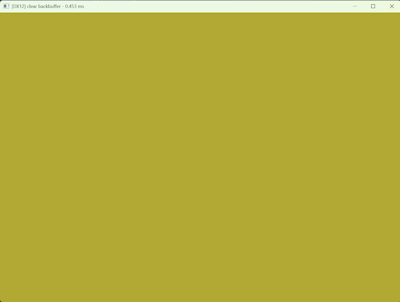
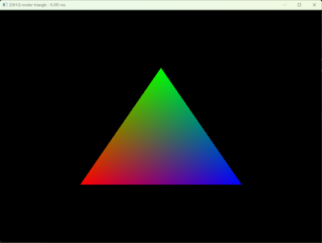
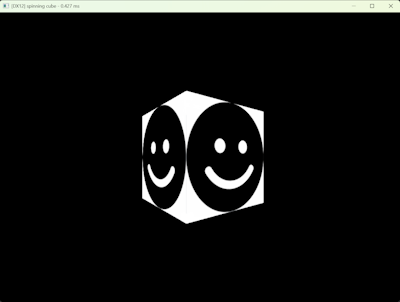

⚠️ This project is currently in development ⚠️

## What is the purpose of this project

This project is a testbed to get more "hands-on" experience with D3D12. It consists of the API, which tries to abstract the usage of the D3D12 API and to simplify resource management and a couple of samples which demonstrates the API usage.

The API is fully implemented in the `k15_d3d12_renderer.hpp` single header library and the samples are in the `tests` folder.

If you have a local Visual Studio installation, you can build the tests locally by running the `win32/build.bat` build script. This will generate the samples inside `win32/build`.

## Tests
| Name | Description | Output |
|------|-------------|--------|
|clear backbuffer|clears backbuffer based on mouse pos||
|render triangle|renders a single triangle||
|spinning cube|renders a spinning cube with a single texture||
